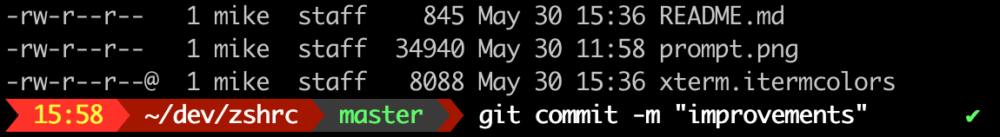

# ZSHRC

## Features
* time, path, git info (branch with dirty/clean status), last exitcode
* improved prompt visibility including bold command text
* enhanced tab completion including within git
* change directories without having to type 'cd'
* working home/end keys (macos)
* choice of color schemes

## Iterm2
Iterm2 should be tweaked as follows:
* enable Powerline glyphs (Preferences > Profiles > Default > Text > enable Use built-in Powerline glyphs.
* apply standard xterm256 colors (Preferences > Profiles > Default > Colors > Color Presets > import and apply the supplied `xterm.itermcolors`.

## Terminal
Terminal requires installation and use a font with the required powerline glyphs, refer:
* https://github.com/supermarin/powerline-fonts
* https://gist.github.com/lujiacn/32b598b1a6a43c996cbd93d42d466466

## Home/End keys
Different platforms need different keycodes mapped; if it doesn't work out of the box, try the included alternate mapping.

## Color Schemes
Adjust `SCHEME` variable in `.zshprompt`.